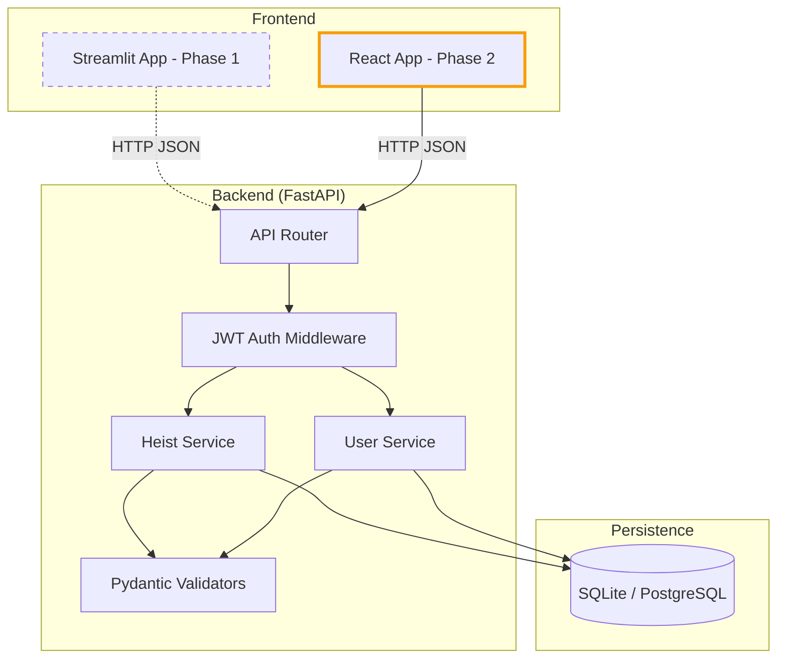
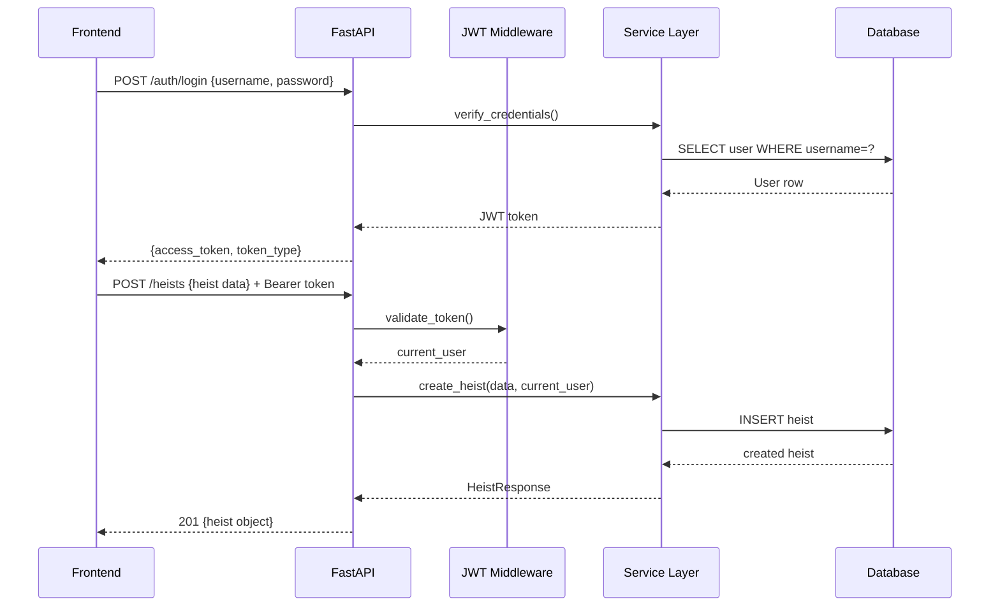
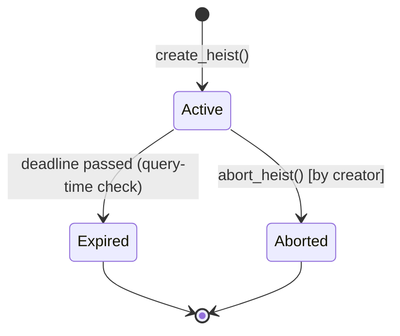

# Design Document: Pocket Heist

## Overview

Pocket Heist is a gamified task-assignment web application with a spy/heist aesthetic. Teams create, assign, and track playful missions ("heists") through a dark-terminal-themed interface. The system is built API-first: a **FastAPI** backend exposes RESTful JSON endpoints, and a **Streamlit** frontend (Phase 1) consumes them. A future React frontend (Phase 2) can replace Streamlit without any backend changes.

Key design goals:
- Clean separation between API and UI layers
- Stateless JWT authentication
- Pydantic-enforced data validation at the API boundary
- Automatic heist expiry via deadline-aware query logic (no background job required for Phase 1)

---

## Architecture



**Note**: Dotted line indicates Phase 1 (Streamlit) is complete but will be replaced. Solid gold line shows Phase 2 (React) as the production target. Both frontends consume the same API without any backend modifications.

### Request Flow



---

## Components and Interfaces

### API Endpoints

| Method | Path | Auth | Description |
|--------|------|------|-------------|
| POST | `/auth/register` | No | Register new user |
| POST | `/auth/login` | No | Login, receive JWT |
| GET | `/heists` | Yes | List active heists (War Room) |
| POST | `/heists` | Yes | Create a new heist |
| GET | `/heists/{id}` | Yes | Get heist details |
| PATCH | `/heists/{id}/abort` | Yes | Abort a heist |
| GET | `/heists/archive` | Yes | List expired/aborted heists (Mission Archive) |
| GET | `/heists/mine` | Yes | List heists created by current user |
| GET | `/docs` | No | OpenAPI interactive docs |

### Phase 1: Streamlit Frontend Screens

Based on the UI mockup (`ui-mockup/streamlit/`), the Streamlit frontend has four screens:

1. **Login Screen** — centered card with "Establish Connection" header, operative codename + encryption key fields, "Authenticate" button. Dark terminal theme (`#0e1117` background, `#ffd700` gold accents).

2. **War Room (Active Operations)** — 2-column card grid. Each heist card has a gold left border, shows title (gold), target, difficulty, assignee, deadline, and an "Abort" button. Matrix-green "▶ IN PROGRESS" status badge.

3. **Mission Archive** — tabular view (`st.table`) of expired/aborted heists.

4. **Plan New Heist (Mission Blueprint)** — form with: Mission Name, Target, Difficulty (selectbox: Training/Easy/Medium/Hard/Legendary), Assign to Operative, Intel/Mission Details (textarea). Deadline auto-set to +3 hours from creation.

Sidebar navigation: War Room | Mission Archive | Plan New Heist, plus "Terminate Session (Logout)" button.

### Phase 2: React Frontend Architecture

Based on the UI mockup (`ui-mockup/react/App.jsx`), the React frontend follows a modern component-based architecture with client-side routing.

#### Technology Stack

- **Build Tool**: Vite (fast dev server, optimized builds)
- **UI Library**: React 18+ with hooks
- **Routing**: React Router v6
- **HTTP Client**: Axios with interceptors
- **Styling**: Tailwind CSS v3
- **Icons**: Lucide React
- **State Management**: React Context API + localStorage
- **Date Handling**: date-fns or dayjs

#### Component Hierarchy

```
App.jsx
├── AuthContext.Provider (auth state)
├── Router
│   ├── /login → LandingPage
│   └── / → DashboardLayout (protected)
│       ├── Sidebar
│       │   ├── Branding
│       │   ├── NavItem × 4
│       │   ├── UserProfile
│       │   └── LogoutButton
│       ├── Header (search, filter)
│       └── Outlet (nested routes)
│           ├── /war-room → WarRoom
│           │   └── HeistGrid
│           │       └── HeistCard × N
│           ├── /my-assignments → MyAssignments
│           │   └── HeistGrid
│           ├── /create → BlueprintStudio
│           │   └── CreateHeistForm
│           └── /archive → IntelArchive
│               └── HeistGrid
```

#### Routing Structure

| Route | Component | Access | Description |
|-------|-----------|--------|-------------|
| `/login` | LandingPage | Public | Login/Register form |
| `/` | DashboardLayout | Protected | Main layout with sidebar |
| `/war-room` | WarRoom | Protected | Active heists (default) |
| `/my-assignments` | MyAssignments | Protected | User's created heists |
| `/create` | BlueprintStudio | Protected | Create new heist form |
| `/archive` | IntelArchive | Protected | Expired/Aborted heists |

Redirect logic:
- `/` → `/war-room` (when authenticated)
- Any protected route → `/login` (when not authenticated)

#### State Management Strategy

**Authentication State** (Context API):
```javascript
// AuthContext.jsx
const AuthContext = createContext({
  user: null,
  token: null,
  isAuthenticated: false,
  login: (username, password) => Promise,
  logout: () => void,
});

// Persisted in localStorage:
// - 'jwt_token': JWT access token
// - 'user': { username, rank } or null
```

**Heist Data** (Component-level state):
- Fetched on mount via `useEffect`
- Stored in component state with `useState`
- Re-fetched after mutations (create, abort)
- No global heist cache (keep it simple for Phase 2)

#### API Client Layer

**Service Architecture:**

```javascript
// src/services/api.js
const api = axios.create({
  baseURL: import.meta.env.VITE_API_BASE_URL,
  headers: { 'Content-Type': 'application/json' }
});

// Request interceptor: inject JWT
api.interceptors.request.use(config => {
  const token = localStorage.getItem('jwt_token');
  if (token) config.headers.Authorization = `Bearer ${token}`;
  return config;
});

// Response interceptor: handle 401
api.interceptors.response.use(
  response => response,
  error => {
    if (error.response?.status === 401) {
      // Clear auth and redirect to login
      localStorage.clear();
      window.location.href = '/login';
    }
    return Promise.reject(error);
  }
);
```

**Service Modules:**

```javascript
// src/services/auth.js
export const authService = {
  register: (username, password) => api.post('/auth/register', { username, password }),
  login: (username, password) => api.post('/auth/login', null, { params: { username, password } }),
  logout: () => { localStorage.clear(); }
};

// src/services/heists.js
export const heistsService = {
  listActive: () => api.get('/heists'),
  listMine: () => api.get('/heists/mine'),
  listArchive: () => api.get('/heists/archive'),
  getById: (id) => api.get(`/heists/${id}`),
  create: (data) => api.post('/heists', data),
  abort: (id) => api.patch(`/heists/${id}/abort`)
};
```

#### Theme and Styling (Tailwind CSS)

**Color Palette:**
```javascript
// tailwind.config.js
module.exports = {
  theme: {
    extend: {
      colors: {
        'dark-bg': '#0a0a0c',        // Main background
        'dark-card': '#111114',       // Card background
        'dark-border': '#1e293b',     // Border color (slate-800)
        'gold': {
          DEFAULT: '#f59e0b',         // amber-500
          light: '#fbbf24',           // amber-400
        }
      }
    }
  }
}
```

**Key Design Patterns:**
- Dark theme with `#0a0a0c` background
- Gold/amber accents (`#f59e0b`) for primary actions and active states
- Rounded corners: `rounded-xl` (cards), `rounded-2xl` (modals)
- Hover effects: border glow, color transitions
- Status badges: green (Active), blue (Completed), rose (Expired/Aborted)
- Glassmorphism: `backdrop-blur-md` on sticky headers

#### React Component Examples

**HeistCard Component:**
```jsx
// src/components/HeistCard.jsx
export const HeistCard = ({ heist, onAbort, showAbort }) => {
  const statusColors = {
    Active: 'text-green-500 border-green-500/20',
    Completed: 'text-blue-500 border-blue-500/20',
    Expired: 'text-rose-500 border-rose-500/20',
    Aborted: 'text-rose-500 border-rose-500/20',
  };

  return (
    <div className="bg-dark-card border border-slate-800 rounded-2xl overflow-hidden hover:border-amber-500/40 transition-all group">
      <div className="p-6">
        <span className={`text-[10px] font-bold uppercase px-2 py-1 rounded bg-slate-900 border ${statusColors[heist.status]}`}>
          {heist.status}
        </span>
        <h3 className="text-xl font-bold text-white mb-2 group-hover:text-amber-500">
          {heist.title}
        </h3>
        <p className="text-slate-400 text-sm line-clamp-2">{heist.description}</p>
        {/* Info rows: Target, Difficulty, Operative, Deadline */}
      </div>
      <div className="bg-slate-900/50 p-4 border-t border-slate-800">
        <button className="text-amber-500 hover:text-amber-400">View Intel</button>
        {showAbort && heist.status === 'Active' && (
          <button onClick={() => onAbort(heist.id)} className="text-rose-500">Abort</button>
        )}
      </div>
    </div>
  );
};
```

**ProtectedRoute Component:**
```jsx
// src/components/ProtectedRoute.jsx
export const ProtectedRoute = ({ children }) => {
  const { isAuthenticated } = useAuth();
  return isAuthenticated ? children : <Navigate to="/login" replace />;
};
```

#### Migration Notes (Streamlit → React)

**What Changes:**
- Session state → localStorage + Context API
- `st.session_state.access_token` → `localStorage.getItem('jwt_token')`
- Page navigation: `st.radio()` → React Router `<Link>` + `useNavigate()`
- Forms: Streamlit form components → controlled inputs with `useState`
- Data fetching: `api_client.py` functions → Axios service calls
- Styling: Streamlit CSS markdown → Tailwind utility classes

**What Stays the Same:**
- **Zero backend changes** — all API endpoints remain identical
- JWT token structure and expiry (24 hours)
- Request/response JSON schemas
- Business logic and validation rules
- Database models and relationships

**Migration Path:**
1. Build React app in parallel (`frontend-react/`)
2. Test against existing backend
3. Deploy React build, update CORS origins
4. Archive Streamlit code (`frontend/` → `frontend-streamlit-legacy/`)

### Service Layer Interfaces

```python
# User Service
def register_user(username: str, password: str) -> UserResponse
def authenticate_user(username: str, password: str) -> str  # returns JWT

# Heist Service
def create_heist(data: HeistCreate, creator: User) -> HeistResponse
def list_active_heists() -> list[HeistResponse]
def list_archive_heists() -> list[HeistResponse]
def list_my_heists(creator: User) -> list[HeistResponse]
def get_heist(heist_id: int) -> HeistResponse
def abort_heist(heist_id: int, requester: User) -> HeistResponse
```

---

## Data Models

### User

```python
class User(Base):
    id: int  # PK
    username: str  # unique, indexed
    hashed_password: str
    created_at: datetime
```

### Heist

```python
class Heist(Base):
    id: int  # PK
    title: str
    target: str
    difficulty: Difficulty  # enum: Training | Easy | Medium | Hard | Legendary
    assignee_username: str
    creator_id: int  # FK -> User.id
    deadline: datetime
    description: str | None
    status: HeistStatus  # enum: Active | Expired | Aborted
    created_at: datetime
```

### Pydantic Schemas

```python
class Difficulty(str, Enum):
    training = "Training"
    easy = "Easy"
    medium = "Medium"
    hard = "Hard"
    legendary = "Legendary"

class HeistStatus(str, Enum):
    active = "Active"
    expired = "Expired"
    aborted = "Aborted"

class HeistCreate(BaseModel):
    title: str
    target: str
    difficulty: Difficulty
    assignee_username: str
    deadline: datetime
    description: str | None = None

    @validator("deadline")
    def deadline_must_be_future(cls, v):
        if v <= datetime.utcnow():
            raise ValueError("deadline must be in the future")
        return v

class HeistResponse(BaseModel):
    id: int
    title: str
    target: str
    difficulty: Difficulty
    assignee_username: str
    creator_username: str
    deadline: datetime
    description: str | None
    status: HeistStatus
    created_at: datetime

    class Config:
        from_attributes = True

class UserCreate(BaseModel):
    username: str
    password: str = Field(min_length=8)

class UserResponse(BaseModel):
    id: int
    username: str
    created_at: datetime

class TokenResponse(BaseModel):
    access_token: str
    token_type: str = "bearer"
```

### Heist Status State Machine



**Expiry strategy**: Rather than a background scheduler, the API applies a deadline check at query time. When listing active heists, the query filters `status == Active AND deadline > now()`. A separate migration/cleanup job can periodically write the Expired status to the DB, but the API never returns a past-deadline heist as Active regardless.

### JWT Token Structure

```json
{
  "sub": "username",
  "user_id": 42,
  "exp": 1234567890,
  "iat": 1234481490
}
```

Token expiry: 24 hours (`exp - iat <= 86400`).

---

## Correctness Properties

*A property is a characteristic or behavior that should hold true across all valid executions of a system — essentially, a formal statement about what the system should do. Properties serve as the bridge between human-readable specifications and machine-verifiable correctness guarantees.*

### Property 1: Password hashing invariant

*For any* valid registration payload, the value stored in the database for the password field SHALL NOT equal the plaintext password provided in the request.

**Validates: Requirements 1.5**

---

### Property 2: Duplicate username rejection

*For any* username that has already been registered, a second registration attempt with that same username SHALL return a 409 status code.

**Validates: Requirements 1.2**

---

### Property 3: Short password rejection

*For any* password string of length 0–7 characters, a registration attempt SHALL return a 422 status code.

**Validates: Requirements 1.3**

---

### Property 4: Login round-trip produces a valid JWT

*For any* successfully registered (username, password) pair, a login request with those credentials SHALL return a 200 status code and a JWT token whose decoded `exp - iat` is at most 86400 seconds.

**Validates: Requirements 2.1, 2.4**

---

### Property 5: Wrong-password login is rejected

*For any* registered username and any password that differs from the registered password, a login attempt SHALL return a 401 status code.

**Validates: Requirements 2.2**

---

### Property 6: Unregistered username login is rejected

*For any* username string that has not been registered, a login attempt SHALL return a 401 status code.

**Validates: Requirements 2.3**

---

### Property 7: All heist endpoints require authentication

*For any* heist management endpoint (GET /heists, POST /heists, GET /heists/{id}, PATCH /heists/{id}/abort, GET /heists/archive, GET /heists/mine), a request made without a valid JWT token SHALL return a 401 status code.

**Validates: Requirements 2.6, 3.1**

---

### Property 8: Heist creation sets creator and Active status

*For any* authenticated user and any valid heist creation payload, the created heist SHALL have `creator_username` equal to the authenticated user's username and `status` equal to `Active`.

**Validates: Requirements 4.5, 4.6**

---

### Property 9: Invalid difficulty values are rejected

*For any* string not in {Training, Easy, Medium, Hard, Legendary} supplied as the `difficulty` field, a heist creation request SHALL return a 422 status code.

**Validates: Requirements 4.3**

---

### Property 10: Past deadline is rejected

*For any* datetime value that is in the past, supplying it as the `deadline` field in a heist creation request SHALL return a 422 status code.

**Validates: Requirements 4.4**

---

### Property 11: Active heist list excludes past-deadline heists

*For any* set of heists in the database, a request to list active heists SHALL return only heists whose `deadline` is strictly in the future and whose `status` is `Active`; no heist with a past deadline SHALL appear in the result.

**Validates: Requirements 5.1, 10.1, 10.2**

---

### Property 12: Archive list contains only Expired or Aborted heists

*For any* set of heists in the database, a request to list the archive SHALL return only heists with `status` equal to `Expired` or `Aborted`; no Active heist SHALL appear.

**Validates: Requirements 7.1**

---

### Property 13: My-heists list contains only the requesting user's heists

*For any* authenticated user, a request to list their own heists SHALL return only heists where `creator_username` equals that user's username; heists created by other users SHALL NOT appear.

**Validates: Requirements 6.1**

---

### Property 14: Heist retrieval round-trip

*For any* valid heist creation payload, creating a heist and then retrieving it by its returned `id` SHALL produce a response object where all fields (title, target, difficulty, assignee_username, creator_username, deadline, description, status) match the original creation data.

**Validates: Requirements 8.1**

---

### Property 15: Non-existent heist retrieval returns 404

*For any* integer ID that does not correspond to an existing heist, a GET /heists/{id} request SHALL return a 404 status code.

**Validates: Requirements 8.2**

---

### Property 16: Abort by non-creator is forbidden

*For any* heist and any authenticated user who is not the creator of that heist, an abort request SHALL return a 403 status code.

**Validates: Requirements 9.2**

---

### Property 17: Abort transitions Active heist to Aborted

*For any* Active heist, an abort request by its creator SHALL return a 200 status code and the heist's `status` SHALL be `Aborted` when subsequently retrieved.

**Validates: Requirements 9.1**

---

### Property 18: Aborting a non-Active heist returns 409

*For any* heist with `status` Expired or Aborted, an abort request SHALL return a 409 status code.

**Validates: Requirements 9.3**

---

### Property 19: Heist serialization round-trip

*For any* valid `HeistResponse` object, serializing it to JSON and deserializing it back SHALL produce an equivalent object with all fields preserved.

**Validates: Requirements 11.4**

---

## Error Handling

### HTTP Error Codes

| Code | Scenario |
|------|----------|
| 200 | Successful read / update |
| 201 | Resource created |
| 401 | Missing, invalid, or expired JWT; wrong credentials |
| 403 | Authenticated but not authorized (e.g., non-creator abort) |
| 404 | Resource not found |
| 409 | Conflict (duplicate username; abort on non-active heist) |
| 422 | Pydantic validation failure (missing fields, bad enum, past deadline, short password) |

### Error Response Shape

All errors return a consistent JSON body:

```json
{
  "detail": "Human-readable description of the error"
}
```

For 422 validation errors, FastAPI's default Pydantic error format is used:

```json
{
  "detail": [
    {
      "loc": ["body", "password"],
      "msg": "ensure this value has at least 8 characters",
      "type": "value_error.any_str.min_length"
    }
  ]
}
```

### Frontend Error Handling

- Login failures: display `st.error("Invalid credentials.")` inline
- Heist creation failures: display `st.warning("Blueprint incomplete. Fill all required fields.")`
- Abort failures: display `st.toast()` with error message
- Network/API errors: display generic `st.error("Connection to HQ lost. Try again.")` with retry option

---

## Testing Strategy

### Dual Testing Approach

Both unit/example tests and property-based tests are used. Unit tests cover specific examples, integration points, and error conditions. Property tests verify universal invariants across randomly generated inputs.

### Property-Based Testing Library

**Python**: [`hypothesis`](https://hypothesis.readthedocs.io/) with `hypothesis.strategies` for generating random users, heist payloads, strings, datetimes, and integers.

Each property test runs a minimum of **100 iterations** (Hypothesis default; increase via `@settings(max_examples=100)`).

Each property test is tagged with a comment referencing the design property:
```python
# Feature: pocket-heist, Property 8: Heist creation sets creator and Active status
```

### Test Structure

```
tests/
  unit/
    test_validators.py       # Pydantic schema validation (Properties 3, 9, 10, 19)
    test_auth.py             # JWT creation/decoding (Property 4)
    test_heist_service.py    # Service layer logic (Properties 8, 11, 12, 13, 17, 18)
  integration/
    test_auth_api.py         # Auth endpoints (Properties 1, 2, 4, 5, 6, 7)
    test_heist_api.py        # Heist endpoints (Properties 8–18)
  smoke/
    test_api_setup.py        # CORS headers, /docs endpoint, JSON content-type (Req 12.1–12.3)
```

### Property Test Examples

```python
from hypothesis import given, settings
from hypothesis import strategies as st

# Feature: pocket-heist, Property 3: Short password rejection
@given(password=st.text(max_size=7))
@settings(max_examples=100)
def test_short_password_rejected(client, password):
    response = client.post("/auth/register", json={"username": "user", "password": password})
    assert response.status_code == 422

# Feature: pocket-heist, Property 11: Active heist list excludes past-deadline heists
@given(past_deadline=st.datetimes(max_value=datetime.utcnow() - timedelta(seconds=1)))
@settings(max_examples=100)
def test_past_deadline_heist_not_in_active_list(client, auth_token, past_deadline):
    # Create heist directly in DB with past deadline
    # List active heists via API
    # Verify the past-deadline heist is not in the response
    ...
```

### Unit Test Examples

```python
# Requirement 2.6 - no token returns 401
def test_protected_endpoint_without_token(client):
    response = client.get("/heists")
    assert response.status_code == 401

# Requirement 9.4 - abort non-existent heist returns 404
def test_abort_nonexistent_heist(client, auth_token):
    response = client.patch("/heists/99999/abort", headers={"Authorization": f"Bearer {auth_token}"})
    assert response.status_code == 404
```

### Smoke Tests

```python
def test_docs_endpoint_accessible(client):
    assert client.get("/docs").status_code == 200

def test_cors_headers_present(client):
    response = client.options("/heists", headers={"Origin": "http://localhost:3000"})
    assert "access-control-allow-origin" in response.headers

def test_all_endpoints_return_json(client, auth_token):
    headers = {"Authorization": f"Bearer {auth_token}"}
    for path in ["/heists", "/heists/archive", "/heists/mine"]:
        r = client.get(path, headers=headers)
        assert r.headers["content-type"].startswith("application/json")
```
